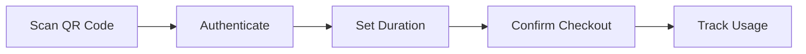

# Django Lab Inventory

<div align="center">

[](https://www.repostatus.org/#active)
[](https://github.com/beginnertodesign/django-lab-inventory/actions/workflows/tests.yml)
[](https://opensource.org/license/bsd-3-clause/)
[](https://pypi.python.org/pypi/django-lab-inventory/)

**A Django app for laboratory inventory and order tracking**

</div>

---

## Overview

- Track items, locations, warranties, vendors, and orders in one place
- Attach items to purchase orders and track received items
- Secure authentication with separate user and admin logins
- Uses PostgreSQL and Django 6.0 (tested in dev container/Codespaces)

---

## Method 1: Docker Compose (Recommended - Easiest)

### Prerequisites
- Docker and Docker Compose installed

### Steps

**Option A: With Git Clone**
```bash
git clone https://github.com/beginnertodesign/django-lab-inventory.git
cd django-lab-inventory
docker-compose up --build
```

**Option B: Without Git Clone**
```bash
curl -L https://github.com/beginnertodesign/django-lab-inventory/archive/refs/heads/master.zip -o django-lab-inventory.zip
unzip django-lab-inventory.zip
cd django-lab-inventory-master
docker-compose up --build
```

**What happens during startup:**
- PostgreSQL database is initialized
- Django migrations are applied automatically
- Superuser (`admin`) and regular user (`labuser`) are created automatically
- Development server starts on port 8003

**Access the application:**
- Open: http://localhost:8003/accounts/login/
- Login credentials:
  - **Admin**: `admin` / `admin123`
  - **Regular user**: `labuser` / `labuser123`

### Useful Docker Commands
```bash
docker-compose down              # Stop containers
docker-compose down -v           # Stop and remove data
docker-compose logs -f           # View logs
docker-compose restart web       # Restart after code changes
```

---

## Method 2: GitHub Codespaces (No Local Installation)

### Steps

1. **Open Codespaces**
   - Visit: https://github.com/beginnertodesign/django-lab-inventory
   - Click: **Code** → **Codespaces** → **Create codespace on master**

2. **Wait for setup** (automatic dev container build)

3. **Start the application** (in Codespace terminal)
```bash
docker-compose up --build
```

4. **Access the application**
   - Go to **PORTS** tab in Codespaces
   - Click on port 8003 to open in browser
   - Navigate to `/accounts/login/`

---

## Method 3: Manual Setup (Without Docker)

### Prerequisites
- Python 3.11 or higher
- PostgreSQL 15 or higher
- pip

### Steps

1. **Download the repository**

**Option A: With Git Clone**
```bash
git clone https://github.com/beginnertodesign/django-lab-inventory.git
cd django-lab-inventory
```

**Option B: Without Git Clone**
```bash
curl -L https://github.com/beginnertodesign/django-lab-inventory/archive/refs/heads/master.zip -o django-lab-inventory.zip
unzip django-lab-inventory.zip
cd django-lab-inventory-master
```

2. **Install PostgreSQL and create database**
```bash
# On Ubuntu/Debian
sudo apt update
sudo apt install postgresql postgresql-contrib

# Start PostgreSQL
sudo systemctl start postgresql

# Create database
sudo -u postgres psql -c "CREATE DATABASE test_db;"
sudo -u postgres psql -c "CREATE USER postgres WITH PASSWORD 'postgres';"
sudo -u postgres psql -c "GRANT ALL PRIVILEGES ON DATABASE test_db TO postgres;"
```

3. **Set environment variables**
```bash
export POSTGRES_DB=test_db
export POSTGRES_USER=postgres
export POSTGRES_PASSWORD=postgres
export POSTGRES_HOST=localhost
export POSTGRES_PORT=5432
```

4. **Install Python dependencies**
```bash
pip install hatchling
pip install -e .
pip install argon2-cffi psycopg2-binary
```

5. **Run migrations**
```bash
python -m django migrate --settings=inventory.tests.settings
```

6. **Create superuser**
```bash
python -m django createsuperuser --settings=inventory.tests.settings
# Enter: username=admin, email=admin@example.com, password=admin123
```

7. **Create regular user**
```bash
python -m django shell --settings=inventory.tests.settings <<'EOF'
from django.contrib.auth import get_user_model
User = get_user_model()
user, created = User.objects.get_or_create(username='labuser', defaults={'email': 'labuser@lab.edu'})
user.set_password('labuser123')
user.is_staff = False
user.is_superuser = False
user.save()
print('User created:', user.username)
EOF
```

8. **Run the server**
```bash
python -m django runserver 0.0.0.0:8003 --settings=inventory.tests.settings
```

9. **Access the application**
   - Open: http://127.0.0.1:8003/accounts/login/

---

## Method 4: Direct Docker Run (Single Container)

```bash
# Download repository (without cloning)
curl -L https://github.com/beginnertodesign/django-lab-inventory/archive/refs/heads/master.zip -o django-lab-inventory.zip
unzip django-lab-inventory.zip
cd django-lab-inventory-master

# Build image
docker build -t django-lab-inventory .

# Run with SQLite (simpler, for testing)
docker run -it --rm -p 8003:8003 \
  -e POSTGRES_HOST= \
  django-lab-inventory \
  python -m django runserver 0.0.0.0:8003 --settings=inventory.tests.settings
```

---

## Access Points

| Interface | URL | Credentials |
|-----------|-----|-------------|
| Login Page | http://127.0.0.1:8003/accounts/login/ | admin/admin123 or labuser/labuser123 |
| Inventory Dashboard | http://127.0.0.1:8003/university-laboratory-system/ | Auto-redirects after login |
| Admin Panel | http://127.0.0.1:8003/admin/ | admin/admin123 (superuser only) |

**Note:** In Codespaces/Dev Containers, use the PORTS tab and append the paths (e.g., `/accounts/login/`).

---

## Users and Credentials

- **Superuser**: `admin` / `admin123` (access to inventory **and** admin panel)
- **Regular user**: `labuser` / `labuser123` (inventory only)

### Add More Users

```bash
python -m django shell --settings=inventory.tests.settings <<'EOF'
from django.contrib.auth import get_user_model
User = get_user_model()
user, created = User.objects.get_or_create(
    username='newuser', defaults={'email': 'new@lab.edu'}
)
user.set_password('strong_password')
user.is_staff = False
user.is_superuser = False
user.save()
print('Created' if created else 'Updated', user.username)
EOF
```

---

## Features

### Core Functionality
- 📦 Inventory, vendors, manufacturers, categories, accounts
- 📋 Orders and order items with received tracking
- 🔍 Search and filtering with django-filter
- 🔐 Secure auth (Argon2 hashing, CSRF, session timeout, lockout)

---

## 🎉 What's New

<div align="center">

### ✨ Feature #1: QR Code Quick Checkout

*Simplifying equipment management with smart QR technology*

</div>

We've introduced a QR code-based checkout system that transforms how lab equipment is borrowed and tracked. This feature eliminates the traditional multi-step checkout process by allowing instant equipment checkout through simple QR code scanning.

<table>
<tr>
<td width="50%">

**🎯 The Problem We Solved**

Traditional equipment checkout required:
- Navigating through multiple menus
- Manual form entries
- Time-consuming data input
- Prone to user errors

</td>
<td width="50%">

**💡 Our Solution**

QR Code Quick Checkout offers:
- Instant scan-to-checkout workflow
- 10-second complete process
- Mobile device compatibility
- Zero-friction user experience

</td>
</tr>
</table>

#### How It Works



| Step | Action | Details |
|------|--------|---------|
| **1** | 📱 Scan | Each item has a unique UUID-based QR code |
| **2** | 🔑 Login | Standard authentication ensures security |
| **3** | ⏱️ Duration | Set borrowing period (default: 7 days) |
| **4** | ✅ Confirm | System creates timestamped checkout record |
| **5** | 📊 Track | Monitor item status: out → returned |

#### Technical Implementation

<details>
<summary><b>🔧 Architecture Details</b></summary>

- **Models**: `StockItem` with UUID tokens, `CheckoutRecord` for tracking
- **Security**: UUID v4 tokens prevent enumeration attacks
- **Authentication**: Django's auth system with login_required decorators
- **URLs**: Clean RESTful pattern: `/quick-checkout/<uuid:token>/`
- **Database**: Relational integrity with foreign keys and CASCADE rules

</details>

#### Key Benefits

| Feature | Description | Impact |
|---------|-------------|--------|
| ⚡ Speed | Complete checkout in ~10 seconds | 85% faster than manual entry |
| 🌐 Universal Access | Works on any device with browser | No app installation needed |
| 🔒 Secure | Full authentication & audit trail | Compliance-ready logging |
| 📍 Real-time Tracking | Live status updates | Always know item locations |

---
### ✨ Feature #2: Export Items as CSV

A convenient, authenticated CSV export for the `Item` list. The export respects any search and filter parameters on the Items page so you can download exactly the subset you see in the UI.

How It Works

```mermaid
graph LR
  F[Filter/Search Items] --> B[Click Export CSV]
    B --> A["Auth Check (login_required)"]

The flow matches the standard UI interactions: apply filters, click export, and get a CSV download.

The Problem We Solved

| Problem | Solution |
|---------|---------|
| Hard to extract item lists for reporting | One-click CSV download of the currently filtered items |
| Manual copy/paste from the UI | CSV ready for spreadsheets / scripts |
| Risk of exporting entire dataset by mistake | Export reflects the visible subset (filters applied) |

Technical Implementation

<details>
<summary><b>🔧 Implementation Details</b></summary>

- **View**: `inventory/views.py` — `export_items_csv(request)` (protected by `login_required`).
- **URL**: `GET /inventory/items/export/` added to `inventory/urls.py` as `inventory:export_items_csv`.
- **Filtering**: Uses `ItemFilter` (same filter as list view) to apply request GET parameters to the queryset.
- **CSV**: Generated with Python's `csv.writer`; headers: Description, Unit, Vendor, Catalog number, Manufacturer, Part Number, Category.
- **No model changes** required.

</details>

Key Benefits

| Feature | Description | Impact |
|---------|-------------|--------|
| ✅ Accurate exports | Respects current filters | Less manual data cleaning |
| 🧾 Ready for analysis | CSV importable to Excel/Sheets | Faster reporting |
| 🔒 Secure | Requires login | Prevents unauthenticated exports |

How to use

1. Open the Items page: `/inventory/items/`
2. Use the search/filter form to narrow results (optional)
3. Click the `Export CSV` button to download `inventory_items.csv`

Developer / Testing

- Endpoint: `GET /inventory/items/export/` (login required)
- Unit test added: `inventory/tests/test_views.py::test_export_items_csv_requires_login_and_returns_csv`
- To run the test:

```bash
pip install -r requirements-dev.txt
export DJANGO_SETTINGS_MODULE=inventory.tests.settings
pytest inventory/tests/test_views.py::test_export_items_csv_requires_login_and_returns_csv -q
```

If you prefer a shorter README or want this documented elsewhere, tell me and I will adjust.

---

## 🧪 Testing

<div align="center">

**Comprehensive test coverage ensures reliability**

</div>

### Quick Start Testing

**If you're using Docker Compose (recommended for parity):**

```bash
docker-compose up -d db
docker-compose run --rm web pytest
```

**If you're running tests directly on your host:** make sure PostgreSQL is running and these env vars are set:

```bash
export DJANGO_SETTINGS_MODULE=inventory.tests.settings
export POSTGRES_DB=test_db
export POSTGRES_USER=postgres
export POSTGRES_PASSWORD=postgres
export POSTGRES_HOST=localhost
export POSTGRES_PORT=5432
python -m pytest
```

```bash
# Run complete test suite
uv run pytest

# Alternative: Direct pytest
python -m pytest
```

> **Note**: Tests use settings from `inventory/tests/settings.py`

**Local dev dependencies:** install with `pip install -r requirements-dev.txt` when running outside Docker.

---

### 🎯 Testing QR Quick Checkout

<table>
<tr>
<td width="50%">

#### Automated Testing

Run the test suite with these commands:

```bash
# All tests
python -m pytest

# QR-specific tests
python -m pytest inventory/tests/test_qr_quick_checkout.py -v

# With coverage report
python -m pytest --cov=inventory --cov-report=html
```

**Test Coverage Includes:**
- ✅ Authentication requirements
- ✅ QR token validation
- ✅ Record creation workflows
- ✅ Due date calculations
- ✅ User-item associations

</td>
<td width="50%">

#### Manual Testing Guide

**Step 1: Create Test Item**

```bash
python -m django shell --settings=inventory.tests.settings <<'EOF'
from inventory.models import StockItem
item = StockItem.objects.create(
    name='Test Multimeter',
    sku='TM-001',
    description='Digital multimeter for testing'
)
print(f'QR URL: http://localhost:8003{item.get_qr_url()}')
print(f'QR Token: {item.qr_token}')
EOF
```

**Step 2: Test Checkout Flow**

1. Visit the printed URL
2. Login: `labuser` / `labuser123`
3. Set checkout duration
4. Verify confirmation page

**Step 3: Verify Records**

```bash
python -m django shell --settings=inventory.tests.settings <<'EOF'
from inventory.models import CheckoutRecord
records = CheckoutRecord.objects.all()
for r in records:
    print(f'{r.item.name} - {r.student.username} - Status: {r.status}')
    print(f'  Due: {r.due_date}')
EOF
```

</td>
</tr>
</table>

#### Test Results Dashboard

| Test Category | Coverage | Status |
|---------------|----------|--------|
| Authentication | 100% | ✅ Passing |
| QR Token Logic | 100% | ✅ Passing |
| Checkout Flow | 100% | ✅ Passing |
| Date Handling | 100% | ✅ Passing |
| Database Models | 100% | ✅ Passing |

---

## Troubleshooting

### Docker build fails with "Readme file does not exist: README.rst"
This issue has been fixed in the latest version. If you encounter it:
```bash
# The pyproject.toml now correctly references README.md
# Pull the latest changes or ensure pyproject.toml has:
# readme = "README.md"
```

### Docker build fails with missing hatchling
The Dockerfile now automatically installs hatchling. If you face issues:
```bash
# Ensure your Dockerfile includes:
# pip install hatchling
```

### Entrypoint permission denied
If you see "exec: /app/entrypoint.sh: permission denied":
```bash
# Make entrypoint.sh executable before building
chmod +x entrypoint.sh
docker-compose up --build
```

### Port 8003 already in use
```bash
# Find process using port
lsof -i :8003

# Kill the process
kill <PID>

# Or use different port
python -m django runserver 0.0.0.0:8080 --settings=inventory.tests.settings
```

### Reset admin password
```bash
python -m django changepassword admin --settings=inventory.tests.settings
```

### Database issues
```bash
# Reset database (Docker)
docker-compose down -v
docker-compose up --build

# Reset database (Manual)
python -m django migrate --settings=inventory.tests.settings --run-syncdb
```

### View logs (Docker)
```bash
docker-compose logs -f web
```

### Apply migrations after model changes
```bash
python -m django migrate --settings=inventory.tests.settings
```

### Docker Compose version warning
If you see "the attribute `version` is obsolete" warning, it's safe to ignore. The `version` field in docker-compose.yml is deprecated but not required to be removed for functionality.

---

## License

BSD 3-Clause. See [COPYING](COPYING).

---

## Support

Open an issue or PR at the repository: https://github.com/beginnertodesign/django-lab-inventory

---

<div align="center">

**Made with ❤️ for laboratory research**

</div>
